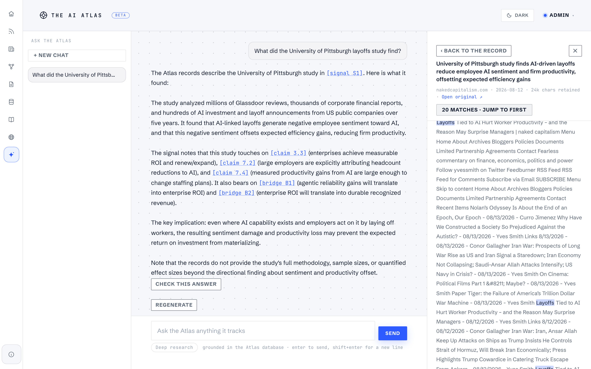

# The AI Atlas

A single-user strategic-intelligence tool for staying oriented in the AI-economy debate: where the disagreement actually is, what evidence would move it, and what happened this week that bears on it.

The core design position: **the model proposes, the human commits.** Every AI feature in this codebase is recommend-only. Confidence never moves without a human-written rationale, discovered signals enter the public record only when a human publishes them, and generated reports cite only records that survive a deterministic citation gate. The goal is orientation, not proof.



## What's inside

One Postgres database (49 tables) holding an argument graph, a signal feed, a research library, and a company funnel, with seven public surfaces over it:

| Surface | What it does |
|---|---|
| **Signal Board** (`/signals`) | A feed of tracked AI developments, each wired back to the falsifiable claims it touches. Fed by an agentic discovery pipeline with a human review gate. |
| **Claims & Theses** (`/map`) | The argument map: open questions → candidate stances → falsifiable claims → cross-domain bridge claims, plus investment-style theses mapped onto the graph. |
| **News Blotter** (`/blotter`) | A broadsheet-style dashboard: health strip, claims ledger, signal wire, pipeline analytics. |
| **Report Portal** (`/reports`) | Generated, citation-gated, PDF-downloadable reports at four granularities (claim tear sheet, lens deep report, executive briefing, thesis report). |
| **Data Portal** (`/datasets`) | The Atlas as a self-service data product: 13 datasets with schema pages, an in-browser explorer, and CSV/JSON downloads. |
| **Research Portal** (`/research`) | An arXiv funnel: pull → triage → analyze → living research threads, with papers feeding the Ask corpus. |
| **Startup Scout** (`/scout`) | A company-discovery funnel: web discovery, an AI scoring agent, dossier enrichment, and a review queue. |

Plus **Ask** (`/ask`): a multi-turn chat workspace grounded in the database via hybrid full-text retrieval, with per-message citation maps, a citation peek panel, a retained-document viewer, an agentic deep-research mode, and a two-layer answer-faithfulness check (deterministic quote/number verification plus a model pass, with flags shown to the reader, never silently applied).

And **Traceroute** (`/traceroute`): a scripted 3D explainer of how a transformer processes a prompt, built from three.js primitives with no model assets.

## Architecture

- **Next.js 16 App Router · React 19 · TypeScript strict · Tailwind v4 (CSS-first)** · Postgres (Supabase) accessed through a raw `pg` pool, server-side only. Every page that reads cookies or the DB is `force-dynamic`; the personal layer (confidence values, rationales, source priors) is stripped server-side before anything reaches a guest.
- **One AI seam.** Nearly every model call routes through `runStructured` (`lib/dossier.ts`): a single forced-tool Anthropic call returning schema-validated JSON, with bounded timeouts and metered cost logging (`lib/cost.ts` → the `/costs` console). The web-enabled exceptions (discovery, scout, the Ask web toggle) share one call shape.
- **The human gate.** `moveConfidence` (`lib/mutations.ts`) is transactional: it requires a rationale, records it append-only, and snapshots all confidences for the `/calibration` time-slider. Pipelines only ever create drafts; publishing is a human act that materializes evidence rows atomically.
- **The citation gate.** Generated report sections pass through `lib/citations.ts` at generate, save, and render time; a sentence citing a record that isn't in the pack is dropped, not repaired.
- **Decomposed pipelines.** The discovery pipeline runs as many short, DB-checkpointed steps (one lens batch per invocation), so runs are resumable and retries are cheap. State lives in the run tables, not in memory.
- **Auth** is a signed HMAC admin cookie that fails closed (`lib/auth.ts`), with cookie-presence routing in `proxy.ts` and real authorization in each page and route.

## Docs

The long-form write-ups are in `docs/`:

- [`core-loop.md`](docs/core-loop.md) — the Signal Board → Map → Ask → Reports loop at three altitudes
- [`prompt-architecture.md`](docs/prompt-architecture.md) — what actually goes to the API: call shapes, caching, schemas
- [`discovery-pipeline-spec.md`](docs/discovery-pipeline-spec.md) — the web-acquisition pipeline, end to end
- [`web-research-pipeline-primer.md`](docs/web-research-pipeline-primer.md) — the non-technical companion
- [`traceroute.md`](docs/traceroute.md) — the 3D transformer explainer
- [`data-portal.md`](docs/data-portal.md) / [`data-portal-upgrade-paths.md`](docs/data-portal-upgrade-paths.md) — the datasets product and its deferred options
- [`research-section.md`](docs/research-section.md) — the arXiv research surface design

## Running it

```bash
npm install
cp .env.example .env.local   # fill in: Postgres connection, ADMIN_PASSWORD, AUTH_SECRET, ANTHROPIC_API_KEY
npm run db:migrate
npm run db:seed
npm run dev                  # http://localhost:3000
npm test                     # 12 read-only/rollback test scripts
```

This is a personal, single-user tool published for reading; it runs, but it is not packaged as a product and there is no support.

## License

**All rights reserved.** This source is published for reading and evaluation only; see [LICENSE.md](LICENSE.md). The bundled fonts are separately licensed under the SIL Open Font License ([`lib/pdf/fonts/OFL.txt`](lib/pdf/fonts/OFL.txt)).
